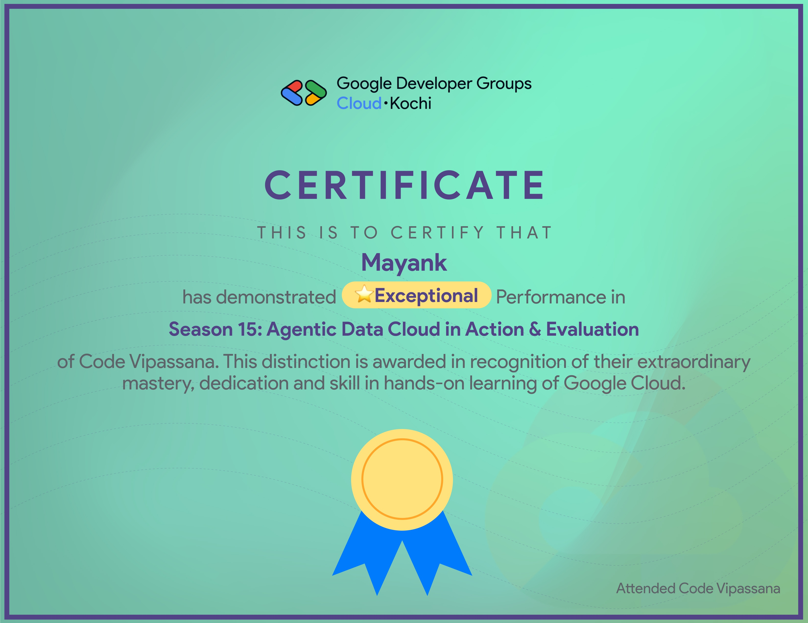

#  Mayank Sharma

<p align="center">
  
</p>

<p align="center">
  
</p>

<p align="center">
  <a href="mailto:mayank.170805@gmail.com">
    
  </a>
  <a href="https://www.linkedin.com/in/sharmamayank178">
    
  </a>
  <a href="https://github.com/mayankinkk">
    
  </a>
</p>

---

## 🧑‍💻 About Me

- 🎓 B.Tech Computer Science & Engineering (2025–2029)
- 🚀 Built **[MIIAM](https://miiam.in)** — a hyperlocal super-app for Northeast India
  (Food delivery, Groceries, Home Services, Printing & more)
- ☁️ Exploring Cloud Computing & DevOps
- 🤖 Learning AI Agents and Intelligent Systems
- 🌱 Active Open Source Contributor

---

# 🛠️ Tech Stack

## Languages


<h3>Languages</h3>

<p>
<a href="https://en.cppreference.com/w/c">

</a>

<a href="https://isocpp.org/">

</a>

<a href="https://developer.mozilla.org/en-US/docs/Web/JavaScript">

</a>

<a href="https://www.typescriptlang.org/">

</a>
</p>

## Frontend

<a href="https://react.dev/">

</a>

<a href="https://nextjs.org/">

</a>

<a href="https://tailwindcss.com/">

</a>

## Backend

<a href="https://nodejs.org/">

</a>

<a href="https://expressjs.com/">

</a>

## Database

<a href="https://www.postgresql.org/">

</a>

## Cloud & DevOps

<a href="https://cloud.google.com/">

</a>

<a href="https://www.docker.com/">

</a>

<a href="https://kubernetes.io/">

</a>
</p>

## Tools

<h3>Tools</h3>

<p>
<a href="https://git-scm.com/" title="Git">

</a>

<a href="https://github.com/" title="GitHub">

</a>

<a href="https://code.visualstudio.com/" title="VS Code">

</a>

<a href="https://www.codeblocks.org/" title="Code::Blocks">

</a>

<a href="https://www.antigravity.io/" title="Antigravity">

</a>
</p>

---

# 🔥 Current Focus

```yaml
Name: Mayank Sharma

Education:
  Degree: B.Tech CSE
  Graduation: 2029

Currently learning:
  - AI Agents
  - Cloud Architecture
  - Kubernetes
  - System Design

Currently building:
  - MIIAM
 
Open_to:
  - Software Engineering Internships
  - Open Source Contributions
  - Collaboration Projects
```

---

# 🚀 Featured Projects

## 🏥 MIIAM

Enterprise-grade food delivery and restaurant management platform.

| Metric     | Details                                            |
| ---------- | -------------------------------------------------- |
| Tech Stack | TypeScript, React, PostgreSQL, Node.js, HTMl, CSS, Python             |
| Features   | Order Tracking, POS Integration, Real-Time Order Tracking, Multi-Vendor Architecture |
| Deployment | Active Development [https://www.miiam.in/]                                   |
| Repository | https://github.com/mayankinkk/MIIAM                |

---

## 🌆 City Sentinel

AI-powered smart city analytics platform.

| Metric     | Details                                           |
| ---------- | ------------------------------------------------- |
| Tech Stack | TypeScript, React, Node.js                        |
| Features   | Urban Intelligence, AI Analysis, Decision Support |
| Repository | https://github.com/mayankinkk/city-sentinel       |

---

## ⌨️ Typing Test

Interactive typing speed and accuracy application.

| Metric     | Details                                   |
| ---------- | ----------------------------------------- |
| Tech Stack | C++                                       |
| Features   | Speed Measurement, Accuracy Tracking      |
| Repository | https://github.com/mayankinkk/typing_test |

---

## 🔤 Word Sort

Word sorting and processing application.

| Metric     | Details                                 |
| ---------- | --------------------------------------- |
| Tech Stack | C++                                     |
| Features   | Sorting Algorithms, String Processing   |
| Repository | https://github.com/mayankinkk/word_sort |

---

# 💼 Experience

## Open Source Contributor

* GSSoC 2026 Contributor
* AI Agents Track
* Open Source Track

## Community Engagement

* GeeksforGeeks Challenges
* API Learning Programs
* Google Cloud Skill Boost

---

# 🏆 Certifications

## Google Cloud

* Prepare Data for ML APIs
* Set Up Google Cloud Environment
* Monitor and Log with Google Cloud
* Implement Load Balancing
* Deploy Kubernetes Applications
* Develop Serverless Apps with Firebase
* Engineer AI Agents with Vertex AI
* Modernize Infrastructure and Applications

## Udemy

* C Programming Bootcamp (44 Hours)
* Beginning C++ Programming (46 Hours)
* Microsoft Office Training: Master Excel, PowerPoint & Word

## GeeksforGeeks

* 60 Days POTD Challenge

## Oracle:

* Oracle Cloud Infrastructure 2025 Certified Foundations Associate

---

## 🏅 Achievements

<p align="center">
  
  
  

  

  
</p>

---

## 📜 Featured Certificate

<p align="center">
  
</p>

<p align="center">
  <a href="Mayank_certificate_s15.jpeg">
    
  </a>
</p>

<p align="center">
  <b>🏆 Exceptional Performance</b><br>
  Season 15: Agentic Data Cloud in Action & Evaluation<br>
  Code Vipassana • Google Developer Groups Cloud Kochi
</p>

---

# 💻 Coding Profiles

- 🟢 GeeksforGeeks:
https://www.geeksforgeeks.org/user/mayankinkk

- 🔵 Unstop:
https://unstop.com/u/mayansha7732

- 🔴 HackerRank: 
https://www.hackerrank.com/profile/mayank_170805

---

# 📈 GitHub Analytics

<p align="center">
  
  
</p>

<p align="center">
  
</p>

---

# 📊 Activity Graph

<p align="center">

</p>

---

# 📫 Connect With Me

* 📧 Email: [mayank.170805@gmail.com](mailto:mayank.170805@gmail.com)
* 💼 LinkedIn: https://www.linkedin.com/in/sharmamayank178
* 💻 GitHub: https://github.com/mayankinkk

---

# 💡 Quote

> **Code. Learn. Build. Repeat.**
>
> Every line of code is a step closer to mastery.

---

## 🐍 Contribution Snake

<p align="center">
  
</p>

---

⭐ Thanks for visiting my profile!

If you find my projects interesting, feel free to connect, collaborate, or follow my journey.

🚀 Let's build something impactful together.
